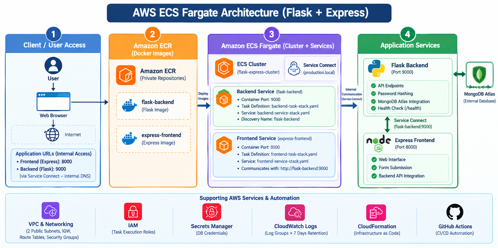

# AWS Assignment 6: Flask Backend & Express Frontend on AWS ECS Fargate

This project contains a containerized Flask backend and an Express frontend application deployed on AWS using Amazon ECR, ECS Fargate, VPC, Security Groups, and CloudFormation.

---

## Live Application Endpoints

- Frontend Application → http://13.201.184.70:8000  
- Backend API → http://13.201.74.220:9000/  
- Backend Health Check → /health

---

## Architecture



---

## Project Folder Structure

```text
aws-ecr-ecs-task/
│
├── .github/
│   └── workflows/
│       ├── backend-deploy.yaml
│       ├── frontend-deploy.yaml
│       └── infrastructure-deploy.yaml
│
├── assets/
│   └── aws-ecs-architecture.png
│
├── backend/
│   ├── myenv/
│   ├── .env
│   ├── .env.example
│   ├── app.py
│   ├── Dockerfile
│   └── requirements.txt
│
├── frontend/
│   ├── node_modules/
│   ├── public/
│   │   ├── index.html
│   │   └── success.html
│   ├── Dockerfile
│   ├── package-lock.json
│   ├── package.json
│   └── server.js
│
├── infrastructure/
│   └── cloudformation/
│       ├── ecr/
│       │   └── ecr-repositories.yaml
│       │
│       ├── ecs/
│       │   ├── backend-service-stack.yaml
│       │   ├── backend-task-stack.yaml
│       │   ├── cluster.yaml
│       │   ├── frontend-service-stack.yaml
│       │   └── frontend-task-stack.yaml
│       │
│       └── network/
│           └── vpc.yaml
│
├── .env.example
├── .gitignore
├── docker-compose.yaml
└── README.md
```

---

## Architecture Deployment Steps

1. Create ECR Repositories (CloudFormation: ecr-repositories.yaml)

2. Build Docker Images Locally
   - Backend: Flask (Runs on port 9000)
   - Frontend: Express (Runs on port 8000)

3. Push Docker Images to Amazon ECR repositories

4. Create VPC & Networking (CloudFormation: vpc.yaml)
   - Custom VPC with 2 Public Subnets
   - Internet Gateway & Route Tables
   - Security Groups: Backend SG (Port 9000) & Frontend SG (Port 8000)

5. Create ECS Cluster (CloudFormation: cluster.yaml)
   - Setup AWS ECS Fargate Cluster

6. Create Task Definitions
   - Backend Task (backend-task-stack.yaml)
   - Frontend Task (frontend-task-stack.yaml – includes environment variables, logging, and health checks)

7. Create ECS Services
   - Backend Service (backend-service-stack.yaml)
   - Frontend Service (frontend-service-stack.yaml)

8. Configure ECS Service Connect
   - Configure Service Connect for internal communication between frontend and backend
   - Configure the ECS cluster with the `production.local` private DNS namespace
   - Register the backend service with the discovery name `flask-backend`
   - Configure the frontend to communicate with the backend using `http://flask-backend:9000`
   - Remove the hardcoded backend public IP address

9. Configure AWS IAM Roles
   - Create ECS task execution roles using CloudFormation
   - Grant the backend task required permission to access AWS Secrets Manager
   - Configure the required ECS task execution permissions

10. Configure AWS Secrets Manager
   - Store database credentials securely in AWS Secrets Manager
   - Configure the backend ECS task to retrieve `DB_USER` and `DB_PASSWORD` from Secrets Manager

11. Configure Amazon CloudWatch Logs
   - Create the backend log group `/ecs/flask-backend-task`
   - Create the frontend log group `/ecs/express-frontend-task`
   - Configure ECS containers to send application logs to CloudWatch
   - Configure log retention for 7 days

12. Configure ECS Health Checks
   - Configure backend health check using `/health`
   - Configure frontend health check using the application root endpoint
   - ECS monitors the health of running containers

13. Configure Infrastructure as Code with CloudFormation
   - Validate CloudFormation templates before deployment
   - Deploy VPC and networking resources
   - Deploy ECR repositories
   - Deploy ECS cluster
   - Deploy ECS task definitions
   - Deploy ECS services

14. Configure GitHub Actions CI/CD
   - Configure backend deployment workflow (`backend-deploy.yaml`)
   - Configure frontend deployment workflow (`frontend-deploy.yaml`)
   - Configure infrastructure deployment workflow (`infrastructure-deploy.yaml`)
   - Build Docker images automatically
   - Push Docker images to Amazon ECR
   - Update ECS task definitions
   - Deploy updated applications to ECS Fargate
   - Wait for ECS service stability after deployment

15. Final Application Verification
   - Verify frontend and backend ECS services
   - Verify ECS tasks are running successfully
   - Verify ECS health checks
   - Verify Service Connect communication
   - Verify CloudWatch application logs
   - Verify frontend form submission
   - Verify backend API communication
   - Verify database integration with MongoDB Atlas

16. Cost Management
   - Stop or scale down unused ECS Fargate resources after testing
   - Monitor ECR image storage
   - Monitor CloudWatch Logs
   - Remove unnecessary AWS resources after completing the assignment
